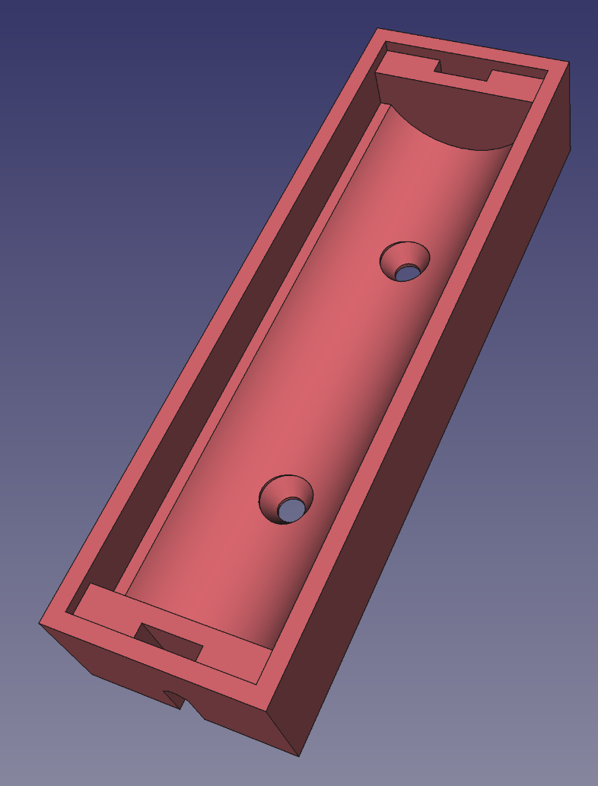
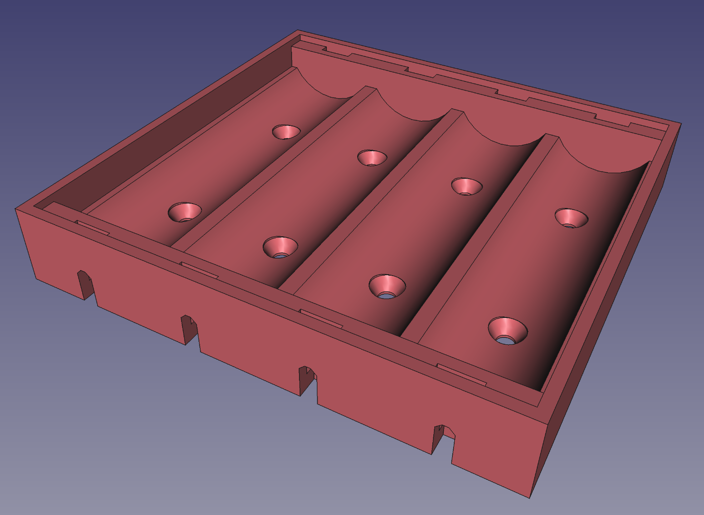
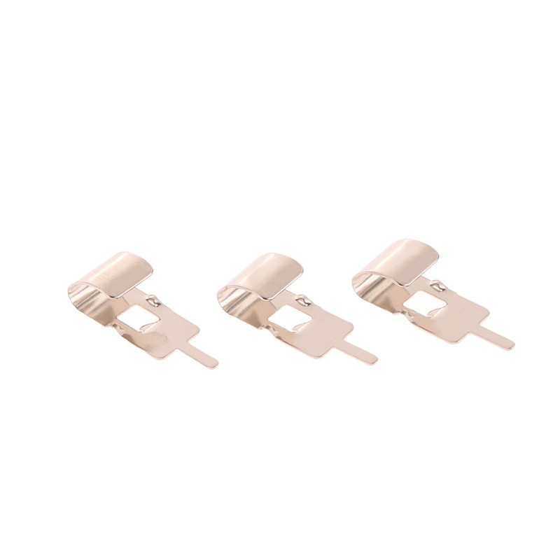
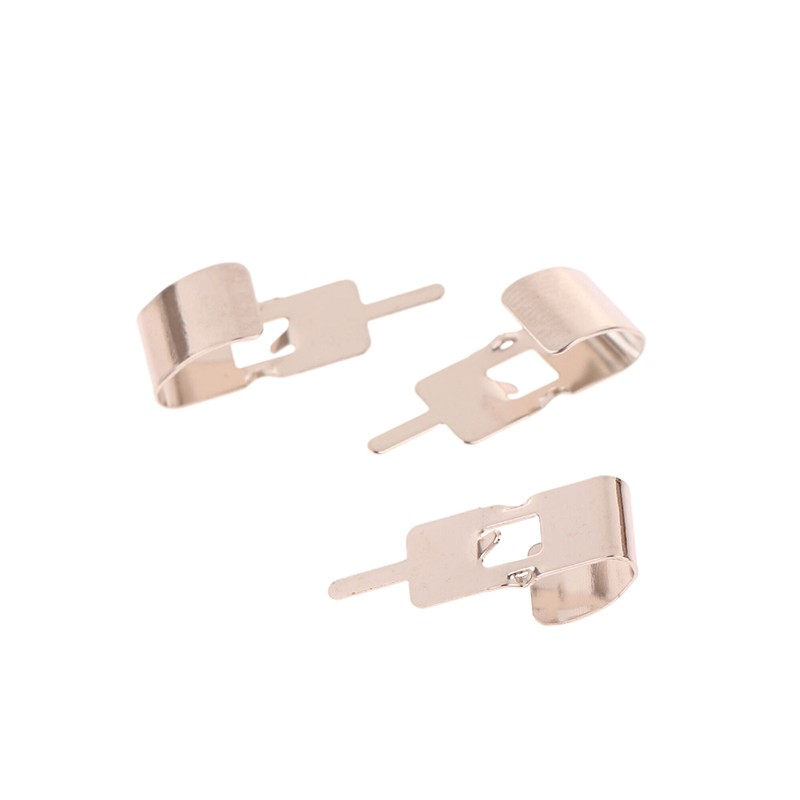
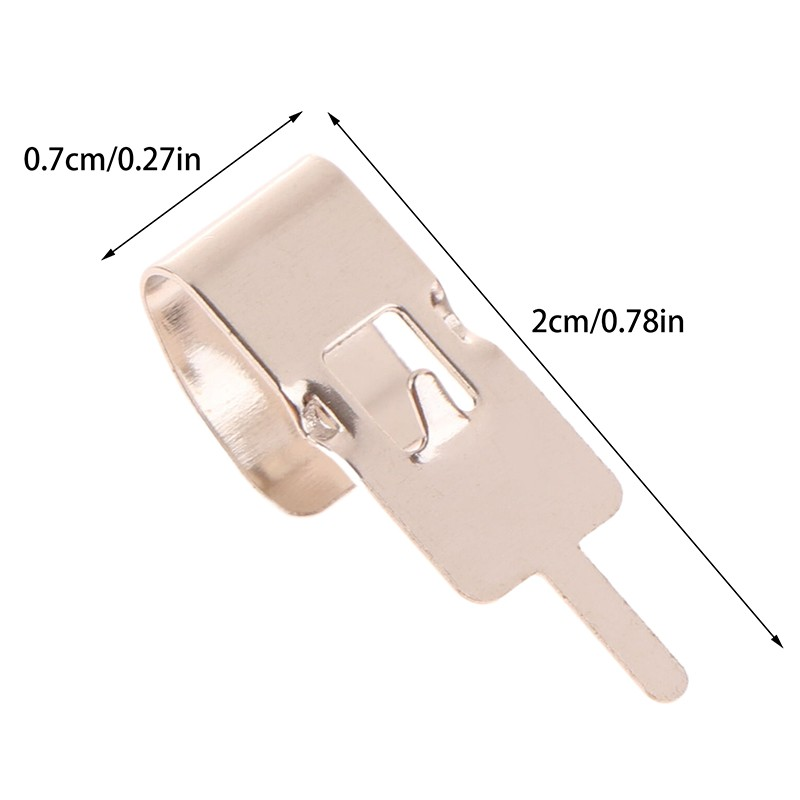

This is a FreeCAD model for printing battery holders for cylindrical cells
(21700, 18650, AA, AAA, etc).

The model is parametric in cell size and the number of cells.

# Battery terminals

This holder uses a pair of cheap spring steel battery contacts for each
cell. They're available from ebay and ali express for about 10 cents each,
so 20 cents for the pair.

There are many different styles of battery terminals, this model requires
a specific one. The vendors change, I've had good luck finding them
using the search term "Spring Steel 18650 Battery Clip 18650 Battery
Holder Battery Contact".

Some examples (these were valid 2025 October 12):
- <https://www.aliexpress.us/item/3256809539540024.html>
- <https://www.ebay.com/itm/127399411665>
- <https://www.ebay.com/itm/389007329289>

